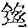
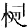
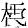
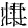

# KanjiGAN (NextRoll Hackweek Summer 2020)

This Kanji Does Not Exist! (c.f. https://thisxdoesnotexist.com/)

Uses a GAN trained on a set of Chinese characters (Kanji) to generate artificial characters:

